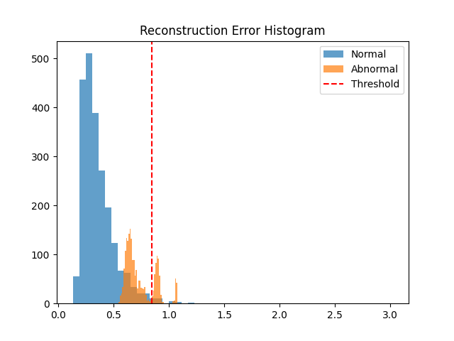
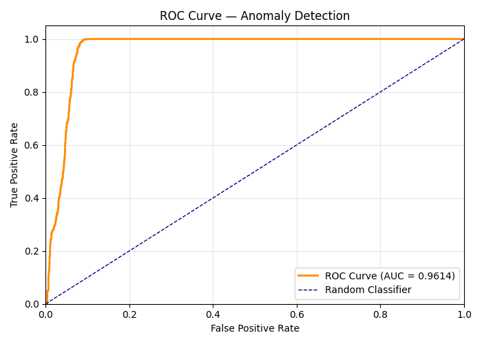

<a id="readme-top"></a>

<br />
<div align="center">

  <h3 align="center">PET ECG MODEL</h3>

  <p align="center">
    Catching abnormal heartbeats using a deep learning autoencoder trained on ECG data.
    <br />
    <br />
    <a href="#how-it-works">How It Works</a>
    &middot;
    <a href="#getting-started">Getting Started</a>
    &middot;
    <a href="#results">Results</a>
  </p>
</div>


<!-- TABLE OF CONTENTS -->
<details>
  <summary>Table of Contents</summary>
  <ol>
    <li><a href="#about">About</a></li>
    <li><a href="#dataset">Dataset</a></li>
    <li><a href="#how-it-works">How It Works</a></li>
    <li><a href="#getting-started">Getting Started</a></li>
    <li><a href="#usage">Usage</a></li>
    <li><a href="#results">Results</a></li>
    <li><a href="#limitations">Limitations</a></li>
    <li><a href="#roadmap">Roadmap</a></li>
  </ol>
</details>


<!-- ABOUT -->
## About

I wanted to see if I could build something that spots weird heartbeats automatically. Turns out, autoencoders are perfect for this b/c you teach them what "normal" looks like, and whatever they can't make is not normal, gets flagged.

The whole pipeline goes: pull ECG data → chop it into individual beats → train the model on the normal ones → flag anything with high reconstruction error. It's really simple in alpha stage.

I used the MIT-BIH Arrhythmia Dataset because it's trustworthy and has proper annotations so I could actually validate if the model was catching real anomalies

### Built With

* Python 3.13
* PyTorch
* WFDB (for reading ECG data from PhysioNet)
* scikit-learn (ROC/AUC evaluation)
* NumPy & Matplotlib

<p align="right">(<a href="#readme-top">back to top</a>)</p>


<!-- DATASET -->
## Dataset

- **Source:** [MIT-BIH Arrhythmia Database](https://physionet.org/content/mitdb/1.0.0/) (via PhysioNet)
- **Sampling rate:** 360 Hz
- **Each heartbeat window:** 360 samples (~1 second)
- Trained on normal beats from record `100`, tested against record `119`

Before anything goes into the model, each beat gets:

1. Extracted by centering on the R-peak annotation (180 samples before, 180 after)
2. Z-score normalized so the scale doesn't throw things off

<p align="right">(<a href="#readme-top">back to top</a>)</p>


<!-- HOW IT WORKS -->
## How It Works

### The Model

Autoencoder compresses everything down to 32 dimensions:

```
Input (360) → 128 → ReLU → Dropout(0.1) → 64 → ReLU → 32 (latent)
                                                          ↓
Output (360) ← 128 ← ReLU ← 64 ← ReLU ← 32
```

The dropout is there so the encoder doesn't just memorize everything.

### Training

- Only sees **normal** heartbeats during training
- MSE loss + Adam optimizer
- 20 epochs (loss drops from ~0.82 to ~0.39)
- Saves weights to `egc_autoencoder.pth`

### Anomaly Detection

Pretty straightforward:

1. Run every beat through the trained model
2. Compute the MSE between the original and the reconstruction
3. Set a threshold at `mean + 3σ` of the normal training errors
4. Anything above that threshold is flagged as anomalous, although the threshold is still buggy.

<p align="right">(<a href="#readme-top">back to top</a>)</p>


<!-- GETTING STARTED -->
## Getting Started

### Prerequisites

You need Python 3.13 (or close to it). Everything else gets pulled in through pip.

### Installation

1. Clone the repo
   ```sh
   git clone https://github.com/your_username/HeartbeatAI.git
   cd HeartbeatAI
   ```
2. Set up a virtual environment
   ```sh
   python -m venv .venv
   .venv\Scripts\activate    # Windows
   # source .venv/bin/activate  # Mac/Linux
   ```
3. Install dependencies
   ```sh
   pip install -r requirements.txt
   ```

That's it. The ECG data gets downloaded automatically from PhysioNet when you run the scripts.

<p align="right">(<a href="#readme-top">back to top</a>)</p>


<!-- USAGE -->
## Usage

Run these in order:

**1. Preprocess** — extracts normal heartbeat windows and saves them to `windows.npy`
```sh
python preprocess.py
```

**2. Train** — trains the autoencoder on those normal windows
```sh
python train.py
```

**3. Evaluate** — loads the model, runs it against a test record, and generates all the plots
```sh
python evaluate.py
```

You'll get an error histogram, ROC curve, and visualizations of the top anomalous beats.

<p align="right">(<a href="#readme-top">back to top</a>)</p>


<!-- RESULTS -->
## Results

Tested on record `119` from MIT-BIH (which has a mix of normal and abnormal beats):

| Metric | Value |
|--------|-------|
| Anomaly threshold | 0.8472 |
| Anomalies detected | 554 / 2093 beats |
| Anomaly score | 0.26 |
| **AUC** | **0.9614** |

The AUC of 0.96 shows the model's quality of separating normal from abnormal beats based on reconstruction error.

### Error Distribution

Normal beats cluster at low error, abnormal beats spread out higher. The red line is the threshold, although threshold seems a little buggy.

<div align="center">
  
</div>

### ROC Curve

<div align="center">
  
</div>

<p align="right">(<a href="#readme-top">back to top</a>)</p>


<!-- LIMITATIONS -->
## Limitations

Being honest about what this doesn't do:

- Only catches **shape-based** abnormalities
- Threshold selection matters a lot
- Single-lead ECG only (the MIT-BIH dataset has two leads, but I only used the first)
- A convolutional or LSTM-based model would probably handle the temporal patterns better

<p align="right">(<a href="#readme-top">back to top</a>)</p>


<!-- ROADMAP -->
## Roadmap

- [x] Basic autoencoder for anomaly detection
- [x] Threshold-based anomaly flagging (mean + 3σ)
- [x] ROC curve and AUC metrics
- [ ] Sliding window support
- [ ] Adaptive threshold tuning
- [ ] Compare against PCA baseline
- [ ] Multi-lead ECG support
- [ ] Swap in a convolutional autoencoder (1D convolutions)
- [ ] Real-time monitoring demo

<p align="right">(<a href="#readme-top">back to top</a>)</p>


<!-- PROJECT STRUCTURE -->
## Project Structure

```
HeartbeatAI/
├── preprocess.py        # loads ECG data, extracts + normalizes beat windows
├── model.py             # autoencoder architecture
├── train.py             # training loop
├── evaluate.py          # evaluation, plots, ROC curve
├── requirements.txt     # pip dependencies
├── windows.npy          # preprocessed normal beat windows (generated)
├── egc_autoencoder.pth  # trained model weights (generated)
├── results/             # saved plots
│   ├── error_histogram.png
│   ├── anomaly_1.png
│   ├── anomaly_2.png
│   ├── anomaly_3.png
│   └── ECGModel.png
└── roc_curve.png
```

<p align="right">(<a href="#readme-top">back to top</a>)</p>
